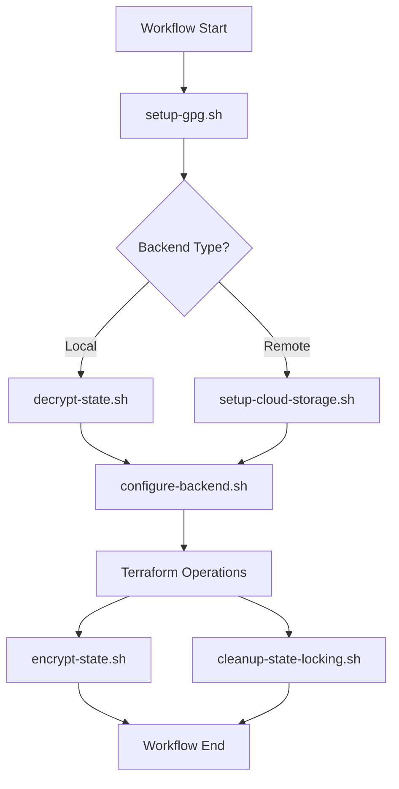

# GitHub Actions Scripts Directory

This directory contains **utility scripts** used by GitHub Actions workflows to automate infrastructure deployment tasks. All scripts are designed for modularity, reusability, and maintainability.

## Purpose

These scripts handle complex operations that would otherwise make workflow files cluttered and hard to maintain. Each script has a specific responsibility and can be used independently or called from workflows.

## Current Scripts Overview

| Script | Purpose | Used By | Status |
|--------|---------|---------|---------|
| `configure-backend.sh` | Generate backend.tf files for Terraform | terraform.yml, terraform-destroy.yml | Active |
| `setup-cloud-storage.sh` | Setup remote storage across cloud providers | terraform.yml (remote backend) | Active |
| `encrypt-state.sh` | Encrypt Terraform state files with GPG | terraform.yml, terraform-destroy.yml | Active |
| `decrypt-state.sh` | Decrypt Terraform state files with GPG | terraform.yml, terraform-destroy.yml | Active |
| `setup-gpg.sh` | Configure GPG environment for encryption | terraform.yml, terraform-destroy.yml | Active |
| `generate-pg-secrets.sh` | Generate PostgreSQL secrets (legacy) | N/A | Legacy |
| `cleanup-state-locking.sh` | Clean up DynamoDB state locks | terraform-destroy.yml | Active |
| `mint-rancher-runtime-tfvars.sh` | Mint Rancher import URL + write runtime tfvars | terraform.yml | Active |
| `write-rancher-runtime-tfvars.sh` | Write `$RUNNER_TEMP/rancher-runtime.tfvars` overrides | terraform.yml, terraform-destroy.yml | Active |
| `rancher-register-cluster.sh` | Register/import cluster via Rancher API | terraform.yml | Active |
| `rancher-fetch-kubeconfig.sh` | Poll active + fetch kubeconfig from Rancher API | terraform.yml | Active |
| `rancher-grant-cluster-access.sh` | Multi-team cluster RBAC (apply/grant-one/list/build-patch) | terraform.yml | Active |
| `wg-env.sh` | WireGuard environment onboard/offboard | wg-onboard.yml | Active |
| `test-*.sh` | Various testing and validation scripts | Manual testing | Active |
| `validate-workflow-integration.sh` | Validate workflow integration | Manual testing | Active |
| `setup-s3-backend.sh` | Empty placeholder | N/A | Placeholder |
| `setup-remote-storage.sh` | Empty placeholder | N/A | Placeholder |

## Core Scripts

### configure-backend.sh

**Purpose**: Generates Terraform backend configuration files based on provider and backend type.

**Usage**:
```bash
./configure-backend.sh --type <local|remote> --provider <aws|azure|gcp> --component <component> [options]
```

**Key Features**:
- Supports local and remote backends
- Cloud-agnostic backend generation
- Custom state file naming for local backends
- Validation and error handling

### encrypt-state.sh / decrypt-state.sh

**Purpose**: GPG encryption and decryption of Terraform state files for secure local storage.

**Usage**:
```bash
# Encrypt state files
./encrypt-state.sh --backend-type local --passphrase <gpg-passphrase>

# Decrypt state files
./decrypt-state.sh --backend-type local --passphrase <gpg-passphrase>
```

**Key Features**:
- AES256 encryption with compression
- Automatic file detection and processing
- Git-safe encrypted storage
- Custom state file naming support

### setup-cloud-storage.sh

**Purpose**: Creates and configures remote storage (S3, Azure Storage, GCS) for Terraform state.

**Usage**:
```bash
./setup-cloud-storage.sh --provider <aws|azure|gcp> --config <config> --branch <branch>
```

**Configuration Formats**:
- **AWS**: `aws:bucket_base:region`
- **Azure**: `azure:resource_group:storage_account:container`
- **GCP**: `gcp:bucket_name:region`

### setup-gpg.sh

**Purpose**: Configures GPG environment for state file encryption in GitHub Actions.

**Usage**:
```bash
./setup-gpg.sh --passphrase <gpg-passphrase>
```

**Key Features**:
- GPG key import and configuration
- Batch mode setup for automation
- Trust database initialization

## Rancher automation scripts

Used when `ENABLE_RANCHER_IMPORT` is enabled on the **infra** terraform workflow. See also [`.github/config/README.md`](../config/README.md) for RBAC catalog and role template ids.

### mint-rancher-runtime-tfvars.sh

**Purpose**: Single entry point for plan-time and pre-apply Rancher import URL minting (calls `rancher-register-cluster.sh` + `write-rancher-runtime-tfvars.sh`).

**Usage**:
```bash
./mint-rancher-runtime-tfvars.sh \
  --rancher-url "$RANCHER_URL" \
  --token "$TOKEN" \
  --cluster-name "$ENV_NAME" \
  --out "$RUNNER_TEMP/rancher-runtime.tfvars" \
  --phase plan   # or apply
```

### write-rancher-runtime-tfvars.sh

**Purpose**: Writes ephemeral `enable_rancher_import` / `rancher_import_url` overrides (never committed to git).

**Usage**:
```bash
./write-rancher-runtime-tfvars.sh --out <path> --enable true --import-cmd '"kubectl apply -f https://..."'
./write-rancher-runtime-tfvars.sh --out <path> --enable false   # destroy workflow
```

### rancher-register-cluster.sh

**Purpose**: Create/find imported cluster in Rancher, mint registration token, print Terraform-compatible import command. Optional `--apply-on-host` for post-apply SSH kubectl apply.

**Usage**:
```bash
./rancher-register-cluster.sh --rancher-url <url> --token <token> --cluster-name <name>
./rancher-register-cluster.sh ... --apply-on-host --ssh-key <path> --ssh-host <ip>
```

**Environment**: `MAX_ATTEMPTS`, `SLEEP_SECONDS` (token poll); `MAX_AGENT_WAIT` (default 90), `AGENT_SLEEP` (default 10) for cattle-cluster-agent wait on `--apply-on-host`.

### rancher-fetch-kubeconfig.sh

**Purpose**: Wait for Rancher cluster `state=active`, then call `generateKubeconfig` API.

**Usage**:
```bash
./rancher-fetch-kubeconfig.sh --rancher-url <url> --token <token> --cluster-name <name>
```

**Environment**: `MAX_ATTEMPTS` (default 90), `SLEEP_SECONDS` (default 10) ≈ 15 minute wait.

### rancher-grant-cluster-access.sh

**Purpose**: Apply cluster RBAC from `.github/config/rancher-access-grants.json` plus env/workflow patches.

**Subcommands**:
- `apply` — CI default after infra apply
- `grant-one` — single group (debugging)
- `list-bindings` — dump existing bindings
- `build-patch` — print workflow merge patch JSON

**Usage**:
```bash
./rancher-grant-cluster-access.sh apply \
  --rancher-url <url> --token <token> --cluster-name <name> \
  --grants-file .github/config/rancher-access-grants.json
```

**Environment**: `RANCHER_ACCESS_GRANTS`, `RANCHER_DEVOPS_*`, `WORKFLOW_*` (set by terraform.yml grant step).

## WireGuard automation

### wg-env.sh

**Purpose**: Onboard/offboard GitHub environment WireGuard secrets (`TF_WG_CONFIG`, `CLUSTER_WIREGUARD_WG0`, `CLUSTER_WIREGUARD_WG1`) via jumpserver SSH + `assigned.txt` peer allocation.

**Usage**:
```bash
./wg-env.sh onboard --env <branch> --host <jumpserver> --ssh-key <path> [--ticket DSD-xxx]
./wg-env.sh offboard --env <branch> --host <jumpserver> --ssh-key <path> [--keep-environment]
```

**Tracker**: Updates `wg-peer-allocation.tsv` locally; `wg-onboard.yml` commits it after non-dry-run.

## Testing and Validation Scripts

### test-infrastructure.sh

**Purpose**: Comprehensive testing of all scripts and workflow combinations.

**Usage**:
```bash
./test-infrastructure.sh [--test-type <scripts|paths|all>] [--provider <provider>]
```

**Test Coverage**:
- Script functionality validation
- Path resolution testing
- Workflow integration testing
- Error handling verification

### validate-workflow-integration.sh

**Purpose**: Validates integration between scripts and GitHub Actions workflows.

**Usage**:
```bash
./validate-workflow-integration.sh [options]
```

## Utility Scripts

### cleanup-state-locking.sh

**Purpose**: Removes DynamoDB state locks when using remote backends.

**Usage**:
```bash
./cleanup-state-locking.sh --provider <provider> --table-name <dynamodb-table>
```

## Legacy Scripts

### generate-pg-secrets.sh

**Status**: Legacy - No longer used 
**Reason**: PostgreSQL configuration now handled via Terraform variables (`enable_postgresql_setup`) 
**Replacement**: Configure PostgreSQL in `terraform/implementations/{cloud}/{component}/{cloud}.tfvars`

## Placeholder Scripts

Some scripts are empty placeholders for future functionality:
- `setup-s3-backend.sh` - Functionality moved to `setup-cloud-storage.sh`
- `setup-remote-storage.sh` - Functionality moved to `setup-cloud-storage.sh`
## Script Integration with Workflows

### Terraform Workflows Integration

**terraform.yml workflow uses these scripts**:
1. `setup-gpg.sh` - Configure GPG for state encryption
2. `decrypt-state.sh` - Decrypt existing state files
3. `configure-backend.sh` - Generate backend configuration
4. `setup-cloud-storage.sh` - Create remote storage (if remote backend)
5. `mint-rancher-runtime-tfvars.sh` - Mint Rancher import URL (when enabled)
6. `write-rancher-runtime-tfvars.sh` - Runtime Rancher tfvars (also via mint helper)
7. `rancher-register-cluster.sh` - Post-apply import on control plane (SSH)
8. `rancher-grant-cluster-access.sh` - Multi-team Rancher RBAC
9. `rancher-fetch-kubeconfig.sh` - Publish KUBECONFIG environment secret
10. `encrypt-state.sh` - Encrypt state files after operations (only after successful plan)

**terraform-destroy.yml workflow uses these scripts**:
1. `setup-gpg.sh` - Configure GPG for state decryption
2. `decrypt-state.sh` - Decrypt state files for destroy operation
3. `configure-backend.sh` - Generate backend configuration
4. `write-rancher-runtime-tfvars.sh` - Disable Rancher import for destroy
5. `cleanup-state-locking.sh` - Clean up state locks after destroy

**wg-onboard.yml workflow uses**:
1. `wg-env.sh` - Peer allocation and GitHub environment secrets

### Script Dependencies



## Directory Structure

```
.github/scripts/
├── README.md                          # This file
├── WORKFLOW_TESTING_GUIDE.md
├── configure-backend.sh
├── setup-cloud-storage.sh
├── encrypt-state.sh
├── decrypt-state.sh
├── setup-gpg.sh
├── cleanup-state-locking.sh
├── mint-rancher-runtime-tfvars.sh     # Rancher URL mint + runtime tfvars
├── write-rancher-runtime-tfvars.sh
├── rancher-register-cluster.sh
├── rancher-fetch-kubeconfig.sh
├── rancher-grant-cluster-access.sh
├── wg-env.sh
├── wg-peer-allocation.tsv             # Repo tracker (header; rows added on onboard)
├── generate-pg-secrets.sh             # Legacy
├── test-infrastructure.sh
├── validate-workflow-integration.sh
└── test-*.sh
```

**Configuration catalog**: `.github/config/rancher-access-grants.json` — see [`.github/config/README.md`](../config/README.md).

## Usage from Workflows

Scripts are called from GitHub Actions workflows with proper error handling:

```yaml
- name: Setup GPG
 run: |
 chmod +x .github/scripts/setup-gpg.sh
 .github/scripts/setup-gpg.sh --passphrase "${{ secrets.GPG_PASSPHRASE }}"

- name: Decrypt State
 run: |
 chmod +x .github/scripts/decrypt-state.sh
 .github/scripts/decrypt-state.sh --backend-type local --passphrase "${{ secrets.GPG_PASSPHRASE }}"
```

## Script Development Guidelines

1. **Modularity**: Each script handles one specific task
2. **Error Handling**: All scripts use `set -e` and proper error checking
3. **Logging**: Clear, structured logging with script name prefixes
4. **Help Usage**: All scripts include `--help` option with usage information
5. **Validation**: Input validation and sanity checks
6. **Cloud Agnostic**: Support multiple cloud providers where applicable

## Testing Scripts

Run the comprehensive test suite to validate all scripts:

```bash
# Test all scripts and combinations
.github/scripts/test-infrastructure.sh

# Test specific functionality
.github/scripts/test-infrastructure.sh --test-type scripts

# Validate workflow integration
.github/scripts/validate-workflow-integration.sh
```

---

**This directory provides the automation backbone for MOSIP infrastructure deployment workflows with secure, modular, and maintainable scripts.**
