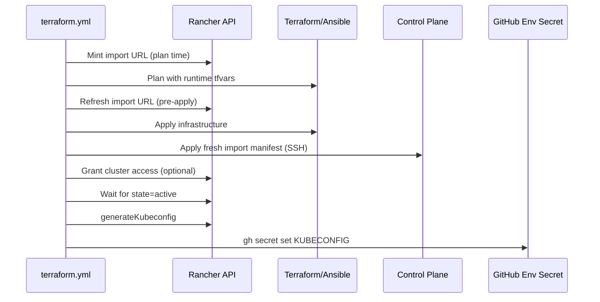

# Rancher Import, Kubeconfig Publish, and Destroy Workflow Guide

This guide documents the **GitHub Actions–driven Rancher integration** for MOSIP `infra` deployments: automatic cluster registration, RBAC grants, kubeconfig publishing, and safe teardown during destroy.

> **Prerequisite:** Deploy `observ-infra` first (Rancher UI + Keycloak). Run the [Keycloak–Rancher SAML integration](../Rancher-keycloak-integration/README.md) before importing downstream clusters.

---

## Table of Contents

1. [Overview](#overview)
2. [Required Secrets and Variables](#required-secrets-and-variables)
3. [Import Paths: Automatic vs Manual](#import-paths-automatic-vs-manual)
4. [Terraform Apply Workflow — Complete Step Flow](#terraform-apply-workflow--complete-step-flow)
5. [Workflow Inputs Reference](#workflow-inputs-reference)
6. [Terraform Destroy Workflow — Complete Step Flow](#terraform-destroy-workflow--complete-step-flow)
7. [Troubleshooting](#troubleshooting)
8. [Legacy Manual Import (tfvars)](#legacy-manual-import-tfvars)

---

## Overview

When deploying the `infra` component with Rancher management (`observ-infra` already deployed), the **`terraform plan / apply`** workflow can:

| Capability | Workflow input | What it does |
|------------|----------------|--------------|
| **Auto-import** | `ENABLE_RANCHER_IMPORT=true` | Mints a fresh Rancher import URL via API, passes it to Terraform/Ansible, then re-applies import on the control plane after apply |
| **Publish kubeconfig** | `PUBLISH_KUBECONFIG=true` (default) | Fetches kubeconfig from Rancher API and sets the branch `KUBECONFIG` environment secret for Helmsman |
| **RBAC grants** | `GRANT_GROUP_ACCESS=true` | Applies team access from `.github/config/rancher-access-grants.json` |
| **Cluster owner override** | `RANCHER_CLUSTER_OWNER_GROUP_ENABLED` | Grants an extra group cluster-owner (DEVOPS remains owner via catalog) |



---

## Required Secrets and Variables

Configure under **Repository → Settings → Environments → `<branch-name>`**:

| Secret / Variable | Required for | Description |
|-------------------|--------------|-------------|
| `RANCHER_API_URL` | Auto-import, kubeconfig publish | Rancher base URL, e.g. `https://rancher.perfm.mosip.net` (**no** `/v3` suffix) |
| `RANCHER_API_TOKEN` | Auto-import, kubeconfig publish | Rancher API bearer token (scoped token from Rancher UI) |
| `GH_INFRA_PAT` | Kubeconfig publish, git push | PAT with `repo` + `secrets` scope for the environment |
| `TF_WG_CONFIG` | Infra apply/destroy | WireGuard config for reaching private nodes |
| `GPG_PASSPHRASE` | Local backend | State encryption passphrase |

Optional repository **variables** for access grants:

| Variable | Purpose |
|----------|---------|
| `RANCHER_ACCESS_GRANTS` | Path override for grants JSON (default: `.github/config/rancher-access-grants.json`) |
| `RANCHER_DEVOPS_GROUP` | DEVOPS group name (default: `DEVOPS`) |
| `RANCHER_GROUP_AUTH_PREFIX` | Prefix for Rancher auth provider group names |

See also: [Secret Generation Guide — Rancher API](SECRET_GENERATION_GUIDE.md#6-kubernetes-config-kubeconfig) and [Secret Generation Guide — KUBECONFIG](SECRET_GENERATION_GUIDE.md#6-kubernetes-config-kubeconfig).

---

## Import Paths: Automatic vs Manual

### Path A — Automatic (recommended for CI)

1. Set workflow inputs `ENABLE_RANCHER_IMPORT=true` and `PUBLISH_KUBECONFIG=true`.
2. Ensure `RANCHER_API_URL` and `RANCHER_API_TOKEN` environment secrets exist.
3. Run **terraform plan / apply** on the `infra` component with **Terraform apply** checked.
4. The workflow handles import URL minting, apply, post-apply SSH import, and kubeconfig publish.

**Do not** set `enable_rancher_import=true` in profile `aws.tfvars` when using this path unless you also maintain a manual URL — the workflow runtime tfvars override takes precedence during apply.

### Path B — Manual (tfvars + Ansible Play 3)

1. Generate import URL from Rancher UI → Cluster Management → Import Existing.
2. Set in profile `aws.tfvars`:
   ```hcl
   enable_rancher_import = true
   rancher_import_url    = "\"kubectl apply -f https://rancher.example.net/v3/import/TOKEN.yaml\""
   ```
3. Run **terraform plan / apply** with `ENABLE_RANCHER_IMPORT=false` (workflow does not mint URL or SSH re-import).
4. Ansible Play 3 executes the import during Terraform apply.
5. Optionally set `PUBLISH_KUBECONFIG=true` to auto-publish kubeconfig after import completes.

### Path comparison

| Aspect | Automatic (`ENABLE_RANCHER_IMPORT=true`) | Manual (tfvars URL) |
|--------|------------------------------------------|---------------------|
| Import URL source | Rancher API (fresh token) | Rancher UI (paste into tfvars) |
| Post-apply import | Workflow SSH step on control plane | Ansible during apply |
| Stale token risk | Low (refreshed before apply + post-apply) | High if URL ages before apply |
| Destroy impact | Disabled automatically | Overridden off at destroy time |

---

## Terraform Apply Workflow — Complete Step Flow

Workflow file: [`.github/workflows/terraform.yml`](../.github/workflows/terraform.yml)

### Common steps (all components)

| # | Step | Purpose |
|---|------|---------|
| 1 | Ensure workflow scripts are executable | `chmod +x .github/scripts/*.sh` |
| 2 | Check for required implementation directory | Validates tfvars path and sets `TFVARS_FILE` |
| 3 | Setup Cloud Storage for Remote State | S3/Azure/GCS when `BACKEND_TYPE=remote` |
| 4 | Configure Terraform Backend | Writes `backend.tf` via `configure-backend.sh` |
| 5 | Skip SSH Host key verification | Runner SSH config |
| 6 | Install / Configure / Start WireGuard | VPN for private node access (`infra`, `observ-infra`) |
| 7 | Setup Terraform | Terraform v1.8.5 |
| 8 | Setup GPG / Decrypt state | Local backend encryption |
| 9 | Display Component Information | Logs component and profile |
| 10 | Terraform fmt / init / validate | Standard Terraform checks |
| 11 | Install Ansible | Required for RKE2 cluster provisioning |

### Infra-only Rancher steps (when `ENABLE_RANCHER_IMPORT=true` and plan succeeds)

| # | Step | Purpose |
|---|------|---------|
| 12 | **Generate Rancher import URL via API** | `rancher-register-cluster.sh` → `write-rancher-runtime-tfvars.sh --enable true` |
| 13 | Terraform Plan | Includes runtime `-var-file` with import command |
| 14 | **Refresh Rancher import URL before apply** | Re-mints URL immediately before apply (avoids stale tokens) |
| 15 | Terraform Apply | Provisions cluster; Ansible may run Play 3 if tfvars also enable import |
| 16 | **Apply Rancher import on cluster (fresh token)** | SSH to control plane; `rancher-register-cluster.sh --apply-on-host` |
| 17 | **Grant Rancher cluster access (multi-team)** | Optional; `rancher-grant-cluster-access-batch.sh` |
| 18 | **Publish KUBECONFIG from Rancher** | When `PUBLISH_KUBECONFIG=true`; waits up to ~6 min for `state=active`, then `gh secret set KUBECONFIG` |

### Post-apply housekeeping

| # | Step | Purpose |
|---|------|---------|
| 19 | Add Terraform state / plan changes | Encrypt state, commit `.tfstate.gpg`, push to branch |
| 20 | Terraform plan / apply status | Fails job if plan, apply, or (when requested) kubeconfig publish failed |

### Recommended infra apply inputs (with Rancher)

```yaml
CLOUD_PROVIDER: aws
TERRAFORM_COMPONENT: infra
INFRA_PROFILE: mosip          # or esignet-standalone
BACKEND_TYPE: local
SSH_PRIVATE_KEY: SSH_PRIVATE_KEY
TERRAFORM_APPLY: true
ENABLE_RANCHER_IMPORT: true
RANCHER_CLUSTER_NAME: performance   # optional; defaults to branch name
PUBLISH_KUBECONFIG: true
GRANT_GROUP_ACCESS: false           # true to apply team grants from JSON catalog
```

---

## Workflow Inputs Reference

| Input | Default | Applies to | Description |
|-------|---------|------------|-------------|
| `ENABLE_RANCHER_IMPORT` | `false` | `infra` + apply | Mint import URL via Rancher API and run post-apply SSH import |
| `RANCHER_CLUSTER_NAME` | branch name | Rancher steps | Name shown in Rancher UI (e.g. `performance`) |
| `PUBLISH_KUBECONFIG` | `true` | `infra` + apply | Fetch kubeconfig from Rancher and set env secret |
| `GRANT_GROUP_ACCESS` | `false` | Post-apply grants | Apply non-DEVOPS teams from grants catalog |
| `RANCHER_CLUSTER_OWNER_GROUP_ENABLED` | `false` | Post-apply grants | Grant extra cluster-owner group |
| `RANCHER_CLUSTER_OWNER_GROUP` | `''` | Post-apply grants | Group name when owner override enabled |

---

## Terraform Destroy Workflow — Complete Step Flow

Workflow file: [`.github/workflows/terraform-destroy.yml`](../.github/workflows/terraform-destroy.yml)

### Step sequence

| # | Step | Purpose |
|---|------|---------|
| 1 | Check implementation directory | Validates tfvars |
| 2 | Check Cloud Storage (remote) | Optional bucket existence check |
| 3 | Configure Terraform Backend | Restores `backend.tf` from branch state path |
| 4 | WireGuard setup | ufw, install, configure, start |
| 5 | Setup Terraform / GPG / Decrypt state | Prepare for destroy |
| 6 | Display Destruction Warning | Logs component and `TERRAFORM_DESTROY` flag |
| 7 | **Prepare destroy env (disable Rancher import)** | `write-rancher-runtime-tfvars.sh --enable false` — prevents Rancher URL preconditions from blocking teardown |
| 8 | Terraform Init | `-reconfigure` fallback if backend changed |
| 9 | Terraform refresh | Sync state with live AWS |
| 10 | Terraform Destroy Plan | Preview resources to destroy |
| 11 | Terraform Destroy | `-auto-approve` when `TERRAFORM_DESTROY=true` |
| 12 | Clean up state files and artifacts | Removes encrypted state, `backend.tf` on success |
| 13 | Cleanup State Locking Resources | Remote backend only |
| 14 | Add the Terraform state changes | Commit deletions, pull/rebase, push (branch names with parentheses are quoted) |
| 15 | Terraform destroy status / success | Fail or confirm success |

### Destroy inputs

```yaml
CLOUD_PROVIDER: aws
TERRAFORM_COMPONENT: infra
INFRA_PROFILE: mosip
BACKEND_TYPE: local
SSH_PRIVATE_KEY: SSH_PRIVATE_KEY
TERRAFORM_DESTROY: true    # REQUIRED — confirms destruction
```

> **Note:** Rancher import is **automatically disabled** during destroy via runtime tfvars. You do not need to edit profile `aws.tfvars` before teardown.

> **Branch names with special characters:** Branches like `perfm(issue1919)` are supported; git sync commands quote the branch name to avoid shell syntax errors.

### Two-run destroy scenario

If a destroy run completes Terraform teardown but fails on the git commit step (e.g. before the branch-quoting fix), re-run the destroy workflow. The second run typically removes remaining Terraform state entries (`null_resource`, `local_file`) and commits state-file deletions.

---

## Troubleshooting

### Kubeconfig publish failed — cluster not active

**Symptoms:** Step `Publish KUBECONFIG from Rancher` exits with error; cluster did not reach `state=active` within ~6 minutes.

**Checks:**
1. Step `Apply Rancher import on cluster (fresh token)` — did it succeed?
2. On control plane: `kubectl get pods -n cattle-system` — is `cattle-cluster-agent` Running?
3. Rancher UI → Cluster Management → cluster state and transitioning message
4. Network: can cluster nodes reach Rancher (WireGuard / security groups)?

**Fix:** Resolve import/connectivity, then re-run apply with `PUBLISH_KUBECONFIG=true` (or run only the publish step logic manually via `rancher-fetch-kubeconfig.sh`).

### Rancher import URL stale

**Symptoms:** Ansible or post-apply import fails with 404/403 on import manifest.

**Automatic path:** Ensure `ENABLE_RANCHER_IMPORT=true` so the workflow refreshes the URL before apply and re-applies on the host after apply.

**Manual path:** Generate a new URL from Rancher UI and update `rancher_import_url` in tfvars.

### Destroy blocked by Rancher precondition

**Symptoms:** Destroy plan/apply fails referencing Rancher import URL.

**Fix:** Ensure you are on a branch with the destroy workflow that includes **Prepare destroy env (disable Rancher import)**. This step writes `enable_rancher_import=false` via runtime tfvars.

### Git commit failed after successful destroy

**Symptoms:** `Destroy complete!` in logs but workflow failed on `Add the Terraform state changes`.

**Common cause:** Branch name contains parentheses (e.g. `perfm(issue1919)`) without quoting in git commands — fixed in current workflow.

**Action:** Re-run destroy; state deletions will be committed on the next successful run.

### Workflow scripts

| Script | Role |
|--------|------|
| `rancher-register-cluster.sh` | Mint import URL; `--apply-on-host` for SSH import |
| `rancher-fetch-kubeconfig.sh` | Poll for active state; fetch kubeconfig YAML |
| `write-rancher-runtime-tfvars.sh` | Runtime enable/disable import for apply vs destroy |
| `rancher-grant-cluster-access-batch.sh` | Apply RBAC from grants catalog |
| `build-rancher-workflow-patch.sh` | Merge workflow inputs with grants JSON |

See [`.github/scripts/README.md`](../.github/scripts/README.md) for full script inventory.

---

## Legacy Manual Import (tfvars)

The manual UI → tfvars path remains supported for environments without Rancher API tokens or for debugging.

See [Main README — Rancher Import Configuration](../README.md#rancher-import-configuration-optional) for step-by-step UI instructions and `rancher_import_url` escaping rules.

When using manual import **with** automatic kubeconfig publish:
- Set `ENABLE_RANCHER_IMPORT=false`
- Set `enable_rancher_import=true` and `rancher_import_url` in profile tfvars
- Set `PUBLISH_KUBECONFIG=true` and ensure `RANCHER_API_*` secrets exist

---

**Related guides:**
- [Workflow Guide](WORKFLOW_GUIDE.md) — GitHub Actions UI walkthrough
- [Terraform Workflow Guide](TERRAFORM_WORKFLOW_GUIDE.md) — Parameter reference
- [Environment Destruction Guide](ENVIRONMENT_DESTRUCTION_GUIDE.md) — Full teardown procedures
- [Secret Generation Guide](SECRET_GENERATION_GUIDE.md) — Credentials setup
