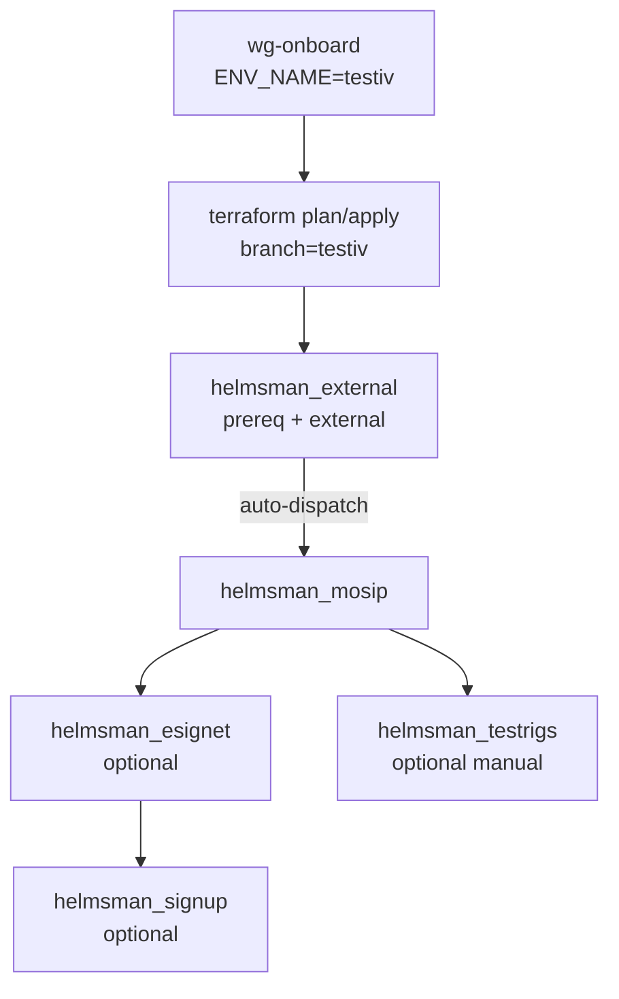

# MOSIP Infra — Agents & Workflow Reference

**Audience:** AI agents, DevOps operators, and QA teams running GitHub Actions on `mosip/infra`.  
**Reference branch:** [`testiv`](https://github.com/mosip/infra/tree/testiv) — active self-service automation environment (region `ap-south-1`, domain from `profiles/mosip/aws.tfvars`).  
**Last updated:** August 2026

---

## Core invariant

```
Git branch name  ==  GitHub Environment name  ==  default Rancher cluster name
```

Example: run workflows from branch **`testiv`** → secrets and variables live under GitHub Environment **`testiv`** → Rancher cluster defaults to **`testiv`** unless `RANCHER_CLUSTER_NAME` is set.

| Concept | testiv example |
|---------|----------------|
| Branch | `testiv` |
| GitHub Environment | `testiv` |
| Terraform state file | `aws-infra-mosip-testiv-terraform.tfstate.gpg` |
| Domain (from tfvars) | `test1.mosip.net` (edit `cluster_env_domain` in profile tfvars) |
| Rancher RBAC catalog | 8 teams — see [Rancher grants on testiv](#rancher-grants-on-testiv) |

---

## Workflow catalog (18 workflows)

| # | File | Actions UI name | Trigger | Runner | Environment |
|---|------|-----------------|---------|--------|-------------|
| 1 | `terraform.yml` | terraform plan / apply | Manual | `ubuntu-latest` | `${{ github.ref_name }}` |
| 2 | `terraform-destroy.yml` | terraform destroy | Manual | `ubuntu-latest` | `${{ github.ref_name }}` |
| 3 | `helmsman_external.yml` | Deploy External services of mosip using Helmsman | Manual, push (DSF) | `ubuntu-latest` | `${{ github.ref_name }}` |
| 4 | `helmsman_mosip.yml` | Deploy Mosip services of mosip using Helmsman | Manual, push (DSF) | `ubuntu-latest` | `${{ github.ref_name }}` |
| 5 | `helmsman_esignet.yml` | Deploy eSignet using Helmsman | Manual, push (DSF) | `ubuntu-latest` | `${{ github.ref_name }}` |
| 6 | `helmsman_signup.yml` | Deploy Signup services using Helmsman | Manual, push (DSF) | `ubuntu-latest` | `${{ github.ref_name }}` |
| 7 | `helmsman_testrigs.yml` | Deploy Testrigs of mosip using Helmsman | Manual, push (DSF) | `ubuntu-latest` | `${{ github.ref_name }}` |
| 8 | `helmsman_external_destroy_external.yml` | Destroy External services (external DSF) | Manual | via reusable | `${{ github.ref_name }}` |
| 9 | `helmsman_external_destroy_prereq.yml` | Destroy Prerequisite services | Manual | `ubuntu-latest` | `${{ github.ref_name }}` |
| 10 | `helmsman_mosip_destroy.yml` | Destroy MOSIP services | Manual | via reusable | `${{ github.ref_name }}` |
| 11 | `helmsman_testrigs_destroy.yml` | Destroy Testrigs | Manual | via reusable | `${{ github.ref_name }}` |
| 12 | `destroy-resources.yml` | *(reusable only)* | `workflow_call` | `ubuntu-latest` | `${{ github.ref_name }}` |
| 13 | `wg-onboard.yml` | WireGuard onboard environment | Manual | `self-hosted` | `${{ inputs.ENV_NAME }}` |
| 14 | `wg-offboard.yml` | WireGuard offboard environment | Manual | `self-hosted` | `${{ inputs.ENV_NAME }}` |
| 15 | `setup-environment-protection.yml` | Setup environment protection | Manual | `ubuntu-latest` | *(none — configures target env)* |
| 16 | `keycloak-rancher-integration.yml` | Keycloak-Rancher SAML Integration | Manual | `ubuntu-latest` | `${{ github.ref_name }}` |
| 17 | `k8s_health_check.yml` | Kubernetes Cluster Health Check | Cron (6h), Manual | `ubuntu-latest` | Repo-level secrets |
| 18 | `validate-infra-secrets.yml` | Validate Infrastructure Secrets | Cron (Mon 08:00 UTC), Manual | `ubuntu-latest` | Repo-level |

---

## Standard deployment pipeline (testiv)



### DSF completion labels (gate chain)

Labels are set on the `default` namespace after successful Helmsman apply:

| Label | Set by | Required before |
|-------|--------|-----------------|
| `external-dsf=completed` | `helmsman_external.yml` | `helmsman_mosip.yml` |
| `mosip-dsf=completed` | `helmsman_mosip.yml` | `helmsman_esignet.yml` (unless standalone), `helmsman_testrigs.yml` (mosip profile) |
| `esignet-dsf=completed` | `helmsman_esignet.yml` | `helmsman_signup.yml`, `helmsman_testrigs.yml` (esignet profile) |

---

## Per-workflow agent notes

### 1. `terraform.yml` — terraform plan / apply

**Purpose:** Provision `base-infra`, `infra`, or `observ-infra` via Terraform + Ansible (RKE2).

**Key inputs:**

| Input | Default | Notes |
|-------|---------|-------|
| `TERRAFORM_COMPONENT` | `infra` | `base-infra` once per VPC; `infra` per environment |
| `INFRA_PROFILE` | `mosip` | `mosip` \| `esignet-standalone` (infra only) |
| `TERRAFORM_APPLY` | false | Check for real deploy |
| `ENABLE_RANCHER_IMPORT` | false | Needs `RANCHER_API_URL` + `RANCHER_API_TOKEN` in environment |
| `PUBLISH_KUBECONFIG` | true | Writes `KUBECONFIG` env secret via `gh secret set` — needs `GH_INFRA_PAT` with **Secrets: Read and write** |
| `GRANT_GROUP_ACCESS` | false | When true, grants all enabled teams from `rancher-access-grants.json` |
| `RANCHER_CLUSTER_OWNER_GROUP_ENABLED` | false | Extra cluster-owner for named group |
| `SSH_PRIVATE_KEY` | required | GitHub secret **name** (e.g. `mosip-aws`) |

**Post-apply Rancher sequence (when `ENABLE_RANCHER_IMPORT=true`):**

1. Mint import URL → `write-rancher-runtime-tfvars.sh` (runtime only, not committed)
2. Terraform apply (RKE2 cluster)
3. `rancher-register-cluster.sh --apply-on-host` (SSH to control plane)
4. `rancher-grant-cluster-access.sh --apply-catalog` — **`continue-on-error: true`**
5. `rancher-fetch-kubeconfig.sh` → `gh secret set KUBECONFIG --env $REF_NAME` — runs with **`if: always()`** when apply succeeded

**Duration (testiv / fresh infra):** plan ~2 min; apply ~15–25 min; full run with Rancher ~20–90 min depending on state.

**Secrets:**

| Scope | Secret |
|-------|--------|
| Repo | `AWS_*`, `GPG_PASSPHRASE`, `GH_INFRA_PAT`, dynamic SSH via input |
| Env (`testiv`) | `TF_WG_CONFIG`, `RANCHER_API_URL`, `RANCHER_API_TOKEN` |

**Vars (env):** `RANCHER_ACCESS_GRANTS`, `RANCHER_DEVOPS_ROLE`, `RANCHER_DEVOPS_ENABLED`

---

### 2. `terraform-destroy.yml` — terraform destroy

**Purpose:** Tear down Terraform-managed resources.

**Requires:** `TERRAFORM_DESTROY=true` confirmation.

**Rancher:** Calls `write-rancher-runtime-tfvars.sh --enable false` so destroy works even when Rancher is unavailable.

**Uses:** Same backend/state paths as apply; `TF_WG_CONFIG` from environment.

---

### 3. `helmsman_external.yml` — Deploy External services

**Purpose:** Parallel deploy of prereq DSF (Istio, monitoring, logging) and external DSF (Keycloak, Kafka, MinIO, captcha, etc.).

**Push triggers:** changes to `Helmsman/dsf/**/prereq-dsf.yaml`, `external-dsf.yaml`.

**After success:** Auto-dispatches `helmsman_mosip.yml` on same branch for `mosip-platform-*` profiles.

**Key inputs:** `profile`, `mode` (`dry-run` \| `apply`), `domain_name`, `db_port`, `clusterid`, `env_name`

**Env secrets:** `KUBECONFIG`, `CLUSTER_WIREGUARD_WG0`, `CLUSTER_WIREGUARD_WG1`, captcha secrets

**Env vars (persisted on dispatch):** `DOMAIN_NAME`, `ENV_NAME`, `CLUSTER_ID`, `DB_PORT`, `ESIGNET_DB_PORT`

---

### 4. `helmsman_mosip.yml` — Deploy MOSIP services

**Purpose:** Core MOSIP platform (ida, idrepo, pms, kernel, etc.).

**Precondition:** `external-dsf=completed` label on `default` namespace.

**Push trigger:** `Helmsman/dsf/**/mosip-dsf.yaml`

**Note:** Testrigs auto-trigger is currently commented out.

---

### 5. `helmsman_esignet.yml` — Deploy eSignet

**Purpose:** eSignet stack (Redis, SoftHSM, Keycloak init, OIDC UI, mock identity).

**Standalone mode:** `skip_mosip_dsf_check=true` or repo var `ESIGNET_STANDALONE_MODE=true`.

**Signup auto-trigger:** currently commented out — run `helmsman_signup.yml` manually.

---

### 6. `helmsman_signup.yml` — Deploy Signup

**Precondition:** `esignet-dsf=completed`

**Secrets:** `MOSIP_SIGNUP_CAPTCHA_SITE_KEY`, `MOSIP_SIGNUP_CAPTCHA_SECRET_KEY`

---

### 7. `helmsman_testrigs.yml` — Deploy Testrigs

**Precondition:** `mosip-dsf=completed` OR `esignet-dsf=completed` (profile-dependent)

**Run manually** after all MOSIP pods are Running.

---

### 8–11. Destroy workflows

All require typing `destroy` in `confirmation` input.

| Workflow | Targets |
|----------|---------|
| `helmsman_external_destroy_external.yml` | keycloak, kafka, minio, activemq, captcha, etc. |
| `helmsman_external_destroy_prereq.yml` | istio-system, cattle-monitoring-system, logging |
| `helmsman_mosip_destroy.yml` | MOSIP app namespaces |
| `helmsman_testrigs_destroy.yml` | apitestrig, dslrig, uitestrig |

**Reusable:** `destroy-resources.yml` — shared teardown logic; uses `KUBECONFIG` + WireGuard from environment.

---

### 13. `wg-onboard.yml` — WireGuard onboard

**Purpose:** Allocate WireGuard peers and publish environment secrets.

**Runner:** **Self-hosted** (required).

**Input `ENV_NAME`:** use `testiv` — creates/binds GitHub Environment `testiv`.

**Creates env secrets:** `TF_WG_CONFIG`, `CLUSTER_WIREGUARD_WG0`, `CLUSTER_WIREGUARD_WG1`

**Repo secrets:** `ACTION_PAT` (needs Secrets R/W), `MOSIP_AWS_PEM`

**Script:** `.github/scripts/wg-env.sh onboard`

---

### 14. `wg-offboard.yml` — WireGuard offboard

**Purpose:** Cryptographic VPN revocation + optional environment deletion.

**Script:** `.github/scripts/wg-env.sh offboard`

**Default:** `REGENERATE_PEERS=true` — same peer slots get new keys for reuse.

---

### 15. `setup-environment-protection.yml` — DevOps approval gates

**Purpose:** Attach required reviewers to a GitHub Environment.

**Input:** `ENV_NAME=testiv`, optional `REVIEWER_TEAMS=devops`

**Config defaults:** `.github/config/environment-protection.json`

---

### 16. `keycloak-rancher-integration.yml` — SAML SSO

**Purpose:** One-time Keycloak ↔ Rancher SAML integration.

**Uses:** `TF_WG_CONFIG` (not `CLUSTER_WIREGUARD_WG0`).

**Run from branch `testiv`** for environment-scoped VPN secret.

---

### 17. `k8s_health_check.yml` — Cluster health

**Schedule:** Every 6 hours.

**Note:** Uses **repo-level** `KUBECONFIG_<ENV>` secrets — `testiv` is not in the default matrix. Add `KUBECONFIG_TESTIV` to monitor testiv.

---

### 18. `validate-infra-secrets.yml` — PAT validation

**Schedule:** Monday 08:00 UTC.

**Validates:** `GH_INFRA_PAT` API access + repo checkout; warns 14 days before `GH_INFRA_PAT_EXPIRES_AT`.

---

## Rancher grants on testiv

On branch **`testiv`**, `.github/config/rancher-access-grants.json` defines **8 teams** with custom Rancher role template IDs:

| Group | Role (testiv) | Default enabled |
|-------|---------------|-----------------|
| DEVOPS | `cluster-owner` | always (via `--apply-catalog`) |
| QA | `rt-jdzrj` | off until `GRANT_GROUP_ACCESS=true` |
| DEV | `rt-jdzrj` | off |
| PM | `rt-rgcq7` | off |
| PO | `rt-rgcq7` | off |
| BA | `rt-rgcq7` | off |
| TL+ARCHITECT | `rt-rgcq7` | off |
| AUTOMATION | `rt-89ntg` | off |

**Grant layers (merged by `group`):** JSON base → `vars.RANCHER_ACCESS_GRANTS` → DEVOPS shortcuts → workflow UI inputs.

### Recommended settings for testiv

| Scenario | `GRANT_GROUP_ACCESS` | `PUBLISH_KUBECONFIG` |
|----------|----------------------|----------------------|
| New env — DEVOPS only | ☐ false | ✅ true |
| Full team RBAC (8 teams) | ✅ true | ✅ true |
| Grant timeout workaround | ☐ false | ✅ true |
| No Rancher | N/A — set `ENABLE_RANCHER_IMPORT=false` | Manual kubeconfig |

### Grant step resilience (latest)

- **Binding cache fix:** `rancher-grant-cluster-access.sh` prefetches cluster bindings once (avoids 8× 60s API lists).
- **409 conflict:** treated as success if binding already exists.
- **Grant step:** `continue-on-error: true` — partial grant failure does not block workflow.
- **KUBECONFIG publish:** `if: always()` when Terraform apply succeeded — publishes even if grant step timed out.

---

## Kubeconfig storage

| Location | How set |
|----------|---------|
| GitHub Environment secret `KUBECONFIG` | `gh secret set KUBECONFIG --env testiv` during terraform publish step |
| Control plane node | `/home/ubuntu/.kube/${CLUSTER_TF_NAME}-CONTROL-PLANE-NODE-1.yaml` |
| Terraform output artifact | Not primary path when Rancher publish is enabled |

---

## Required PAT scopes (`GH_INFRA_PAT`)

| Permission | Level | Why |
|------------|-------|-----|
| Contents | Read and write | State commit, repo push |
| Metadata | Read-only | Required |
| Actions | Read and write | Workflow dispatch (eSignet → signup) |
| Environments | Read and write | Environment config |
| Variables | Read and write | Persist Helmsman vars |
| **Secrets** | **Read and write** | **`gh secret set KUBECONFIG`**, WireGuard onboard/offboard |

`ACTION_PAT` (WireGuard workflows) also needs **Secrets: Read and write**.

---

## testiv quick-start checklist

```
[ ] 1. wg-onboard.yml          ENV_NAME=testiv, DRY_RUN=false, JUMPSERVER_HOST=<ip>
[ ] 2. setup-environment-protection.yml  ENV_NAME=testiv  (optional)
[ ] 3. Branch testiv exists; edit profiles/mosip/aws.tfvars (cluster_name, domain, zone_id)
[ ] 4. Environment secrets: RANCHER_API_URL, RANCHER_API_TOKEN
[ ] 5. Captcha secrets (6) on environment testiv
[ ] 6. terraform.yml           branch=testiv, infra, mosip, TERRAFORM_APPLY=true
                               ENABLE_RANCHER_IMPORT=true, PUBLISH_KUBECONFIG=true
[ ] 7. helmsman_external.yml   branch=testiv, mode=apply, domain_name=<domain>
[ ] 8. Wait for helmsman_mosip auto-trigger
[ ] 9. helmsman_testrigs.yml   optional, after pods Running
```

---

## Troubleshooting (agent playbook)

| Symptom | Likely cause | Action |
|---------|--------------|--------|
| Grant fails `curl: (28) Timeout` at N/8 | Old grant script without cache fix; Rancher API slow | Merge latest `rancher-grant-cluster-access.sh`; re-run with `GRANT_GROUP_ACCESS=false` to publish KUBECONFIG |
| KUBECONFIG not in GitHub env | Grant failed before `always()` publish fix | Re-run with `PUBLISH_KUBECONFIG=true`; verify `GH_INFRA_PAT` has Secrets R/W |
| Apply stuck on `download_kubeconfig_files` | Ansible fetch on all nodes; file only on control plane | Cancel run; resume apply (known issue — see terraform module) |
| `Secret not found: TF_WG_CONFIG` | Skipped WireGuard onboard | Run `wg-onboard.yml` with `ENV_NAME=testiv` |
| `external-dsf=completed` missing | External Helmsman not applied | Run `helmsman_external.yml` with `mode=apply` |
| Rancher unavailable | observ-infra not deployed | Set `ENABLE_RANCHER_IMPORT=false`; copy kubeconfig manually from control plane |
| `fatal: could not read Username` | Expired `GH_INFRA_PAT` | Rotate token; run `validate-infra-secrets.yml` |

---

## Related documentation

| Document | Topic |
|----------|-------|
| [SELF_SERVICE_DEPLOYMENT_GUIDE.md](SELF_SERVICE_DEPLOYMENT_GUIDE.md) | Full QA/dev runbook |
| [AUTOMATION_IMPROVEMENTS.md](AUTOMATION_IMPROVEMENTS.md) | Approval gates, Rancher RBAC, WG offboard |
| [SECRET_GENERATION_GUIDE.md](SECRET_GENERATION_GUIDE.md) | Credentials and PAT scopes |
| [TERRAFORM_WORKFLOW_GUIDE.md](TERRAFORM_WORKFLOW_GUIDE.md) | Terraform input reference |
| [.github/config/README.md](../.github/config/README.md) | Rancher grants JSON schema |
| [.github/workflows/README.md](../.github/workflows/README.md) | Workflow architecture |

---

*For AI agents: prefer branch `testiv` on `mosip/infra` when validating against production-like self-service automation. Feature fixes land on `Ivanmeneges-patch-kubeconfig` → merge/cherry-pick to `testiv`.*
